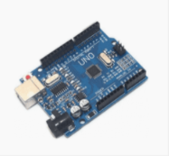
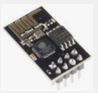
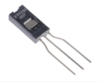
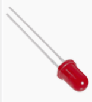
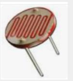
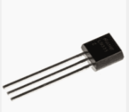
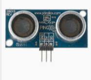
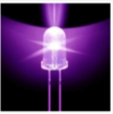
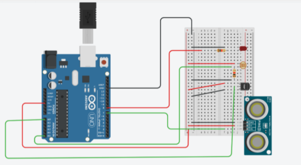

# iot-project

## Introduction

Greench helps to keep your plants healthy and green. To do this, our device heats up when needed and tells you when you need to water it. In addition, it automatically provides the brightness your plants need, and tells you when to turn it off.

## How does it work ?

We have several sensors that detect humidity, temperature, light and height of the plant. If the brightness is too low, the UV LED will turn on. If it is too cold the heating will turn on. If there isn't enough sunrays, with a lack of humidity, the LED will light up to notify the user that it needs watering.

## Components

## Electrical circuit

https://www.tinkercad.com/things/1ebmUXF9yS1
